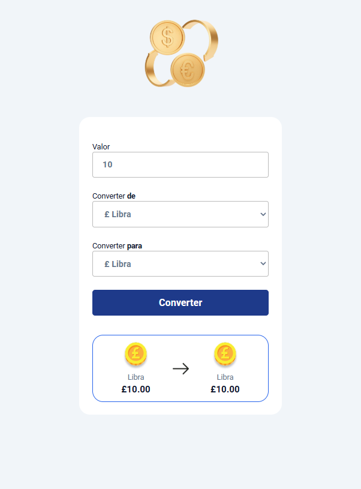

# 💱 Conversor de Moedas

Um conversor de moedas desenvolvido com **HTML, CSS e JavaScript**, criado para praticar lógica de programação, manipulação do DOM e conversões entre diferentes moedas.

## 📌 Sobre o projeto

O Conversor de Moedas permite que o usuário informe um valor e escolha uma moeda de origem e uma moeda de destino.

O projeto trabalha com:

- 🇧🇷 Real Brasileiro (BRL)
- 🇺🇸 Dólar Americano (USD)
- 🇪🇺 Euro (EUR)
- 🇬🇧 Libra Esterlina (GBP)

O sistema realiza os cálculos e apresenta o resultado formatado de acordo com a moeda selecionada.

## 🚀 Funcionalidades

- 💰 Conversão entre diferentes moedas
- 🔄 Seleção da moeda de origem e destino
- 🏳️ Alteração das bandeiras de acordo com a moeda selecionada
- 💵 Formatação dos valores utilizando `Intl.NumberFormat`
- 📱 Interface responsiva

## 🛠️ Tecnologias utilizadas

- HTML5
- CSS3
- JavaScript
- Google Fonts
- `Intl.NumberFormat`

## 🧠 Conceitos praticados

- Manipulação do DOM
- `querySelector` e `getElementById`
- Eventos com `addEventListener`
- Estruturas condicionais `if`
- Funções
- Conversões matemáticas
- Manipulação de valores de inputs
- Formatação de moedas

## 📸 Preview



## ▶️ Como executar

1. Clone o repositório:

```bash
git clone URL_DO_SEU_REPOSITORIO
```
2. Abra a pasta do projeto
3. Abra o aruivo 'index.html' no navegador
Também é possível utilizar a extensão Live Server no VS Code

## 📚 Objetivo 

Este projeto foi desenvolvido como parte dos meus estudos de JavaScript, com o objetivo de praticar conceitos fundamentais de desenvolvimento web e lógica de programação.

## 👨‍💻 Autor
Luan Caiana

Projeto desenvolvido para fins de estudo e aprendizado em desenvolvimento web.
